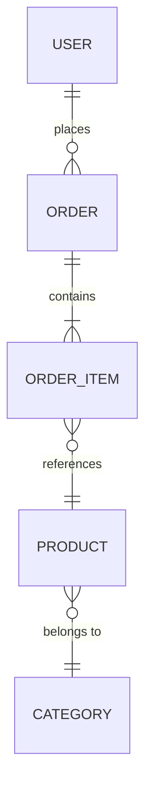

# Product Analysis Reference

## Purpose

Transform product specifications (Notion docs, HTML prototypes, wireframes, READMEs,
business rules) into a structured backend design. The output is a set of design artifacts
that Phase B consumes — never raw code.

## Process

### Step 1 — Read Everything First

Ingest every provided document before writing anything. Build a mental model of the full
product, not one screen at a time. Look for:

- Who are the user roles? (customer, admin, operator, guest, system)
- What are the core business workflows end to end?
- Where does money, status, or ownership change hands? (these are your domain events)
- What data is shared across screens? (these become shared capabilities, not duplicated endpoints)

### Step 2 — Identify Business Domains

Group related functionality into bounded contexts. A domain is a business concept cluster,
not a UI section. Examples:

| UI section | Actual domain |
|------------|---------------|
| "User Profile" + "Account Settings" + "Avatar Upload" | **Identity** |
| "Product List" + "Product Detail" + "Inventory" | **Catalog** |
| "Cart" + "Checkout" + "Payment" | **Commerce** |
| "Order History" + "Order Detail" + "Refund" | **Order Management** |

If two screens read/write the same core entity, they belong to the same domain.

### Step 3 — Map User Journeys

For each domain, trace the user journey:

```
[Actor] → [Action] → [System Response] → [State Change] → [Side Effects]
```

Example:
```
Customer → places order → system validates stock, calculates total
  → order status = PENDING → email confirmation, stock reservation, payment hold
```

Capture every state transition. These become your domain events and async jobs.

### Step 4 — Extract Capabilities (not endpoints)

A **capability** is a reusable business operation. An **endpoint** is just its HTTP surface.

Think: "What can the system do?" not "What does this screen need?"

Bad (screen-driven):
```
GET /product-list-page/products
GET /search-results-page/products
GET /admin-products-page/products
```

Good (capability-driven):
```
Capability: Query Products
Endpoint: GET /api/v1/products?filter=...&sort=...&cursor=...
Consumers: Product List Page, Search Results, Admin Products, Recommendation Widget
```

### Deduplication Heuristics

Before adding a new capability, check:

1. **Same entity, same verb** → almost certainly the same capability.
   "List products for storefront" and "list products for admin" differ only in filters/fields,
   not in the underlying operation.

2. **Same entity, different verb** → different capability, same module.
   "Create order" and "cancel order" are distinct capabilities in the Order module.

3. **Different entity, same pattern** → reusable generic capability?
   If you have "search products", "search users", "search orders" — consider whether a
   generic search/filter capability applies, or whether domain-specific logic justifies
   separate implementations.

4. **Aggregation screens** (dashboards) → read-only capabilities that combine data from
   multiple domains. Implement as a dedicated query/view, not as N+1 calls from the frontend.

### Step 5 — Define Entities & Relationships

For each domain, list:

- **Entities**: nouns that have identity and lifecycle (User, Order, Product)
- **Value Objects** (opt-in DDD): immutable descriptors (Money, Address, DateRange)
- **Relationships**: one-to-one, one-to-many, many-to-many with join semantics
- **Ownership**: which entity is the aggregate root? (Orders own OrderItems; OrderItems don't exist independently)

Produce a Mermaid ER diagram:



### Step 6 — Define Permissions

For every capability, specify:

| Capability | Roles Allowed | Row-level Rule | Notes |
|------------|---------------|----------------|-------|
| Create Order | CUSTOMER | own orders only | guests → redirect to auth |
| Cancel Order | CUSTOMER, ADMIN | customer: own only; admin: any | only if status=PENDING |
| List All Orders | ADMIN, OPERATOR | ADMIN: all; OPERATOR: assigned region | pagination required |

### Step 7 — Identify Edge Cases & Error Scenarios

For each capability:

- What if the entity doesn't exist? (404 vs 410 for soft-deleted)
- What if the user lacks permission? (403)
- What if concurrent modification? (optimistic lock conflict → 409)
- What if a downstream service is unavailable? (circuit breaker, retry, fallback)
- What if input exceeds limits? (file size, array length, string length)
- What if the operation is duplicated? (idempotency key)

### Step 8 — Compile the Requirement Analysis

Output format:

```markdown
# Requirement Analysis: [Project Name]

## Domains
| Domain | Description | Core Entities | Key Capabilities |
|--------|-------------|---------------|------------------|

## User Journeys
### [Journey Name]
Actor: ...
Steps: ...
State transitions: ...
Side effects: ...

## Capability Registry (draft)
| ID | Capability | Domain | Endpoint | HTTP | Consumers (screens) |
|----|-----------|--------|----------|------|---------------------|

## Entities & Relationships
[Mermaid ER diagram]

## Permissions Matrix
[table from Step 6]

## Edge Cases & Open Questions
[grouped by domain]

## Assumptions
| # | Assumption | Confidence | Impact if Wrong |
|---|-----------|------------|-----------------|
```

This document feeds directly into database design (ref 03), API contract (ref 04),
and the capability registry (`docs/api-capability-registry.md`).
