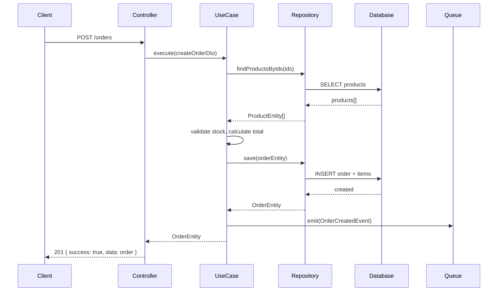

# Architecture Reference

## Core Pattern: Clean Architecture + Modular Monolith

```
┌─────────────────────────────────────────────────┐
│  HTTP Layer (Controllers, Guards, Interceptors)  │  ← Framework-dependent
├─────────────────────────────────────────────────┤
│  Application Layer (UseCases, DTOs, Ports)       │  ← Orchestration
├─────────────────────────────────────────────────┤
│  Domain Layer (Entities, Value Objects, Events)  │  ← Pure business logic
├─────────────────────────────────────────────────┤
│  Infrastructure (Repositories, External APIs)    │  ← Data access, 3rd party
└─────────────────────────────────────────────────┘
```

**Dependency Rule**: Dependencies point inward. Domain never imports from Infrastructure.
Controllers never import Prisma. UseCases never import from `@nestjs/common`.

## Folder Structure

```
src/
├── main.ts                          # Bootstrap, global pipes/filters
├── app.module.ts                    # Root module, imports feature modules
├── config/
│   ├── config.module.ts             # ConfigModule.forRoot
│   ├── database.config.ts
│   ├── redis.config.ts
│   ├── auth.config.ts
│   └── app.config.ts
├── common/
│   ├── decorators/                  # @CurrentUser, @Roles, @ApiPaginated
│   ├── dtos/
│   │   ├── pagination.dto.ts        # CursorPaginationDto, OffsetPaginationDto
│   │   └── api-response.dto.ts      # Standard envelope
│   ├── filters/
│   │   ├── all-exceptions.filter.ts
│   │   └── prisma-exception.filter.ts
│   ├── guards/
│   │   ├── jwt-auth.guard.ts
│   │   └── roles.guard.ts
│   ├── interceptors/
│   │   ├── transform.interceptor.ts # Wraps responses in standard envelope
│   │   ├── logging.interceptor.ts
│   │   └── timeout.interceptor.ts
│   ├── pipes/
│   │   └── parse-cursor.pipe.ts
│   └── interfaces/
│       ├── repository.interface.ts  # Generic IRepository<T>
│       └── usecase.interface.ts     # IUseCase<Input, Output>
├── modules/
│   ├── auth/                        # Authentication & authorization
│   ├── users/                       # User management
│   ├── [domain-module]/             # One folder per business domain
│   │   ├── [domain].module.ts       # NestJS module declaration
│   │   ├── controllers/
│   │   │   └── [domain].controller.ts
│   │   ├── dtos/
│   │   │   ├── create-[entity].dto.ts
│   │   │   ├── update-[entity].dto.ts
│   │   │   └── query-[entity].dto.ts
│   │   ├── usecases/
│   │   │   ├── create-[entity].usecase.ts
│   │   │   ├── update-[entity].usecase.ts
│   │   │   ├── get-[entity].usecase.ts
│   │   │   ├── list-[entities].usecase.ts
│   │   │   └── delete-[entity].usecase.ts
│   │   ├── repositories/
│   │   │   ├── [domain].repository.interface.ts  # Port
│   │   │   └── [domain].prisma-repository.ts     # Adapter
│   │   ├── entities/
│   │   │   └── [entity].entity.ts   # Domain entity (plain TS class)
│   │   ├── events/                  # Domain events (optional)
│   │   ├── guards/                  # Module-specific guards (optional)
│   │   ├── jobs/                    # BullMQ processors (optional)
│   │   └── subscribers/             # Event handlers (optional)
│   └── shared/                      # Cross-module shared code (minimal)
│       ├── shared.module.ts
│       └── services/
│           ├── email.service.ts
│           └── storage.service.ts
├── prisma/
│   ├── schema.prisma
│   ├── migrations/
│   └── seed.ts
├── jobs/                            # BullMQ job definitions
│   └── queue.module.ts
└── health/
    ├── health.module.ts
    └── health.controller.ts
```

## Module Isolation Rules

1. **No cross-module repository imports.** If Module A needs data from Module B,
   Module B exposes a **service** (not a repository). Module A imports Module B's
   NestJS module and uses its public service.

2. **Module public API = its NestJS module exports.** Only services intended for
   cross-module use go in `exports: []`. Repositories, usecases, and controllers
   stay internal.

3. **Shared module is for infrastructure concerns** (email, storage, caching),
   never for business logic. If two modules share business logic, either one owns
   it and exports a service, or it belongs to a new domain module.

4. **Circular dependency = architecture smell.** If Module A imports Module B and
   Module B imports Module A, extract the shared concern into a new module or use
   domain events for decoupling.

## Layer Responsibilities

### Controller
- Parse HTTP request (params, query, body, headers)
- Call one UseCase
- Return response (transformation handled by interceptor)
- Apply decorators: `@ApiTags`, `@UseGuards`, `@Roles`
- NEVER contain business logic, database calls, or complex conditional branching

### DTO (Data Transfer Object)
- Validate input at the boundary using `class-validator`
- Transform input using `class-transformer`
- One DTO per operation direction (CreateOrderDto ≠ UpdateOrderDto)
- Nested DTOs for complex structures
- DTOs are framework-coupled (decorators OK here)

### UseCase
- Single business operation per class
- Implements `IUseCase<TInput, TOutput>`
- Orchestrates: validate business rules → call repository → emit events → return result
- Pure business logic: no HTTP concepts (`Request`, `Response`, status codes)
- Receives and returns domain entities or plain objects, never Prisma models

### Repository
- Interface (port) in the module, implementation (adapter) in the same folder
- Maps between Prisma models and domain entities
- Handles query building, pagination cursors, soft-delete filters
- NestJS DI wires the implementation to the interface token

### Domain Entity
- Plain TypeScript class, no decorators, no framework imports
- Contains validation logic intrinsic to the entity (e.g., `order.canBeCancelled()`)
- Immutable value objects where appropriate (Money, Address)

## Dependency Injection Pattern

```typescript
// Repository interface (port)
export const ORDER_REPOSITORY = Symbol('ORDER_REPOSITORY');

export interface IOrderRepository {
  findById(id: string): Promise<OrderEntity | null>;
  save(order: OrderEntity): Promise<OrderEntity>;
}

// Prisma implementation (adapter)
@Injectable()
export class OrderPrismaRepository implements IOrderRepository {
  constructor(private readonly prisma: PrismaService) {}

  async findById(id: string): Promise<OrderEntity | null> {
    const record = await this.prisma.order.findFirst({
      where: { id, deletedAt: null },
    });
    return record ? OrderEntity.fromPrisma(record) : null;
  }
}

// Module wiring
@Module({
  providers: [
    { provide: ORDER_REPOSITORY, useClass: OrderPrismaRepository },
    CreateOrderUseCase,
  ],
  controllers: [OrderController],
})
export class OrderModule {}

// UseCase injection
@Injectable()
export class CreateOrderUseCase implements IUseCase<CreateOrderInput, OrderEntity> {
  constructor(
    @Inject(ORDER_REPOSITORY) private readonly orderRepo: IOrderRepository,
  ) {}
}
```

## When to Apply DDD

DDD adds ceremony. Apply it proportionally:

| Domain complexity | Approach |
|-------------------|----------|
| Simple CRUD (settings, tags) | Repository + UseCase, no aggregates or value objects |
| Medium (users, products) | Entities with business methods, repository pattern |
| Complex (orders, payments, subscriptions) | Full DDD: aggregates, value objects, domain events |

The trigger for "full DDD" is: multiple entities that must change together atomically,
or business rules that span entity relationships.

## Sequence Diagram Convention

Use Mermaid sequence diagrams for non-trivial flows:



Generate sequence diagrams for: payment flows, multi-step workflows, async job chains,
and any operation involving more than 2 services.
